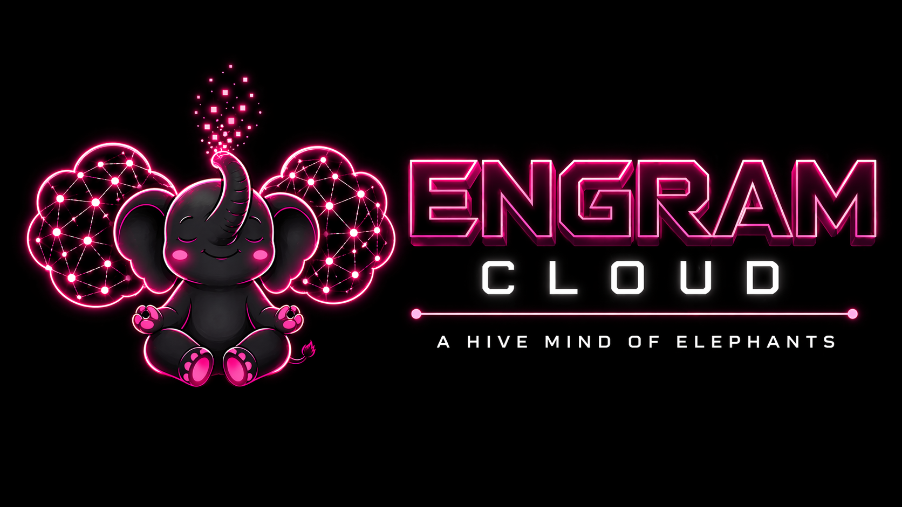
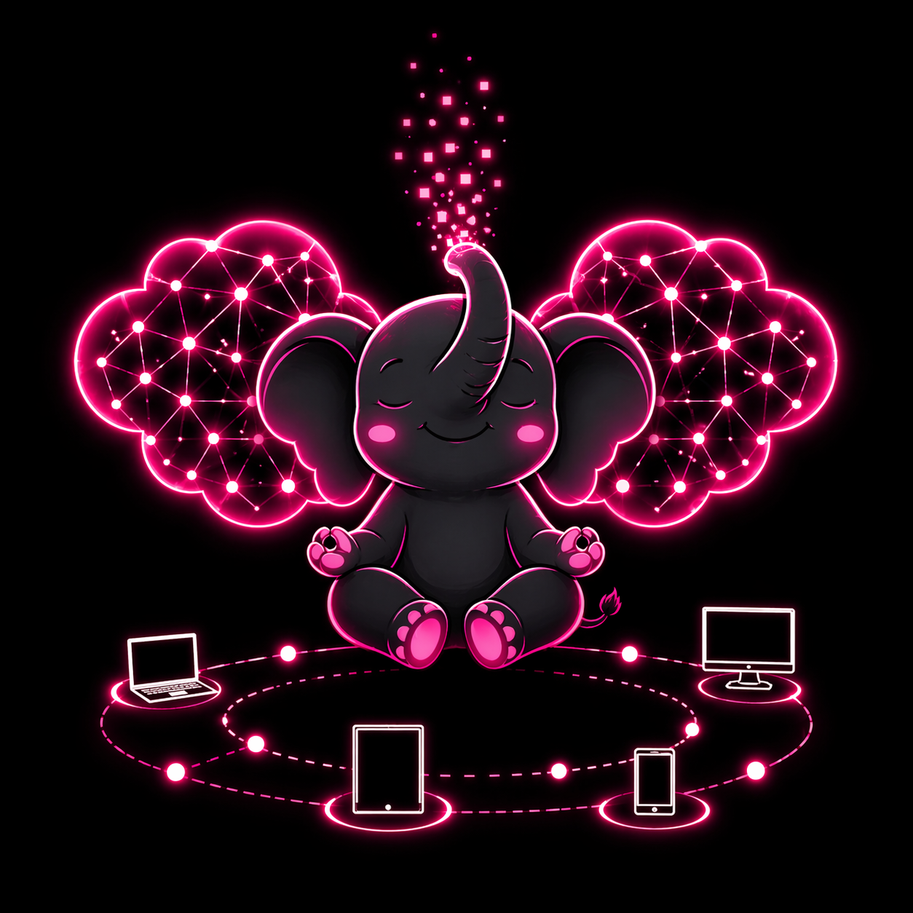
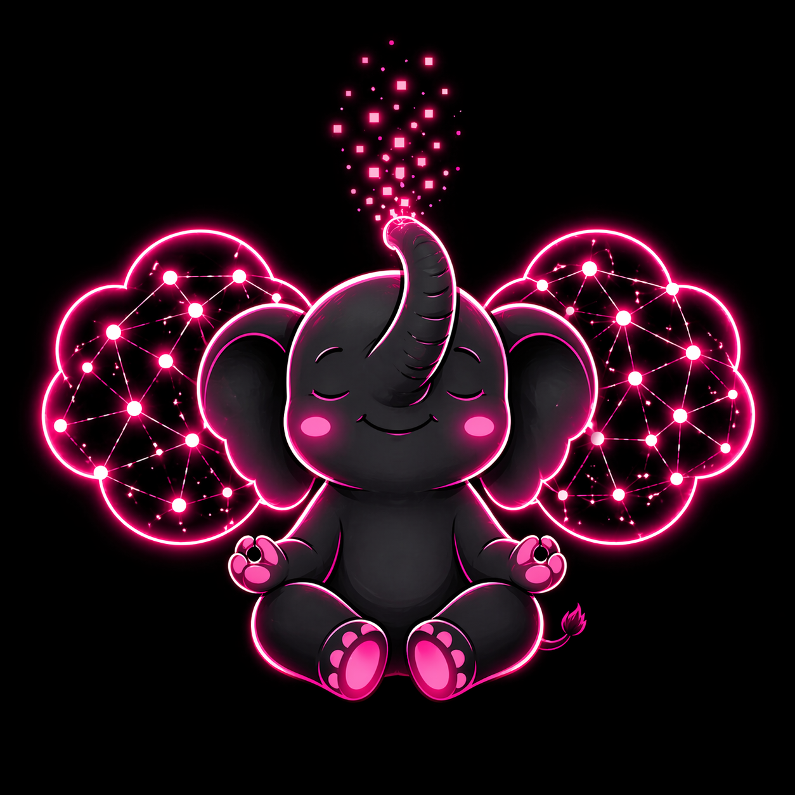

[← Back to AriaCore Cloud](./README.md)

# AriaCore Cloud Branding

This page defines the visual identity and asset usage for **AriaCore Cloud**.

Current assets live under `assets/branding/`.

---

## Brand Positioning

AriaCore Cloud should feel:

- local-first
- futuristic
- self-hosted
- developer-grade
- reliable
- slightly playful, without losing technical credibility

Core idea:

> a shared memory mesh that remains under the developer's control.

---

## Core Motif

The elephant remains the identity anchor, extended for cloud continuity:

- cloud/memory mesh geometry
- neon/future glow
- multi-device continuity motifs

---

## Asset Set

```text
assets/branding/aria-core-cloud-logo.png
assets/branding/aria-core-cloud-elephant-network.png
assets/branding/aria-core-cloud-elephant.png
```

### Preview







---

## Intended Roles

### `aria-core-cloud-logo.png`
- Hero image in cloud docs
- Launch/social/release visual

### `aria-core-cloud-elephant-network.png`
- Architecture/deployment continuity visual
- Multi-machine sync concept visual

### `aria-core-cloud-elephant.png`
- Supporting mascot accent in lighter sections
- Login/dashboard branding accents (sparingly)

---

## Usage Notes

### Do
- Keep dark theme coherent
- Keep contrast high for text and status UI
- Use elephant + network motif to reinforce memory continuity

### Don’t
- Let branding crowd out operational/product information
- Use low-contrast body copy on dark backgrounds
- Mix unrelated mascot styles

---

## Integration Links

- Cloud landing page: [AriaCore Cloud](./README.md)
- Top-level product docs: [README](../../README.md)
